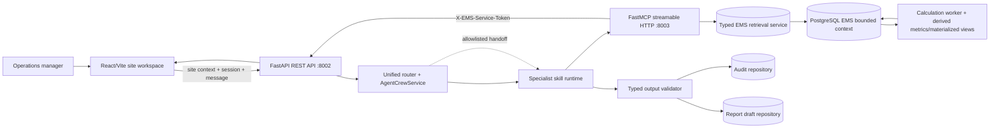

# Verde EMS AgentCrew MVP — System Architecture

> Framework choices are governed by the standalone [Framework and Runtime Decisions](00-framework-decisions.md) document. Do not infer framework approval from this architecture document or from an implementation file.

**Status:** Implemented local MVP architecture; production hardening pending
**Owner:** Software Architect
**Dependencies:** Product Lead backlog, existing site-integration React/Vite shell, FastAPI/Uvicorn service, FastMCP process, browser/backend AgentCrew contracts, deterministic skill packages and fixtures, Security Engineer review
**Last updated:** 2026-07-22
**Implementation mapping:** `services/ems-api/src/agentcrew/app.py`, `service.py`, `mcp_server.py`, `config.py`, `apps/site-integration-app/src/agentcrew/api.js`
**Acceptance mapping:** `services/ems-api/tests/test_fastapi_app.py`, `services/ems-api/tests/test_runtime.py`, `services/ems-api/tests/test_skill_packages.py`, and [the readiness checklist](12-integration-readiness-checklist.md)

**Source and operating links:**

- [Product backlog and acceptance](./01-product-backlog-and-acceptance.md)
- [AppDeploy operating rules](../../AGENTS.md)
- [Approved AgentCrew grill session](../../agentcrew-grill-session.html)
- [Site Integration App context](../../../docs/context/apps/site-integration-app/README.md)
- [Browser AgentCrew contracts](../../../apps/site-integration-app/src/agentcrew/contracts.ts)
- [Browser site-context gate](../../../apps/site-integration-app/src/agentcrew/siteContext.ts)
- [EMS database and MCP design](./16-ems-database-and-mcp-design.md)
- [Backend AgentCrew contracts](../../../services/ems-api/src/agentcrew/contracts.py)
- [Backend typed errors](../../../services/ems-api/src/agentcrew/errors.py)

## 1. Architectural intent

The MVP is a site-scoped AgentCrew inside the existing map-first dashboard. A manager opens an authorized site, asks one unified drawer for help, approves bounded tool steps, and receives a truthful result. The proving workflow is:



The design is a modular monolith at the service boundary, not a microservice fleet. It keeps the safety-critical workflow transactional and easy to test while preserving seams for later extraction.

### EMS data and calculation path

EMS telemetry is persisted separately from AgentCrew operational state. Synthetic development sources enter Bronze ingestion tables, are normalized into Silver canonical observations, and then feed a calculation worker. Expensive or frequently requested metrics are persisted in `derived_metric_values`; common LLM/dashboard summaries are served from materialized views. FastAPI exposes bounded repository queries, and FastMCP delegates only named read tools to FastAPI.

```text
device/fake source → Bronze lineage → Silver facts → calculation worker
→ derived_metric_values/materialized views → FastAPI EMS API → typed MCP → LLM
```

The calculation worker recalculates affected windows after ingestion and records `formula_version`, `calculated_at`, quality state, and source-window hash. The LLM must receive freshness and quality metadata and must never execute arbitrary formulas or SQL.

### Non-negotiable boundaries

- AgentCrew exists only for a valid, authorized site workspace. Portfolio routes do not create an MCP-capable context.
- Every request, handoff, approval, MCP attempt, validation result, violation, and output carries one `site_id` and a correlation/run identifier.
- The browser owns site context, drawer interaction, confirmations, preview rendering, and view-only audit presentation.
- The AgentCrew service owns routing, skill overlays, approval policy, MCP enforcement, validation, interruption recovery, audit retention, and report-draft persistence.
- Skills receive current-site data through typed MCP tools; they cannot select another site, create tools, or change permissions.
- Hidden chain-of-thought, secrets, credentials, and unrelated sensitive attributes are never exposed or persisted.

## 2. Implemented boundary

### Existing executable baseline

The site app uses hash routes such as `#site/tokyo-campus/overview`, with site tabs `overview`, `devices`, `ems`, `reports`, `alerts`, and `site`. `getActiveSiteContext()` validates the route against known sites and a non-empty user ID, returning `null` for portfolio, unknown-site, malformed, or invalid-tab routes. The app currently builds site workspaces from local EMS fixtures and renders report records in the Reports tab.

The shared browser and backend contracts already agree on:

- four hats: `site_security_manager`, `device_monitoring_expert`, `data_analysis_specialist`, `report_generation_specialist`;
- run states: `queued`, `running`, approval/removal/repair waits, `completed`, `interrupted`, `failed`, and `failed_validation`;
- session approval modes: `approve_step` and `approve_all_session`;
- `ActiveSiteContext`, `SkillVersion`, `ApprovalAction`, `AgentCrewRun`, and typed error codes.

The domain value objects remain framework-free, but the executable boundary is implemented. FastAPI owns the REST routes, request validation, CORS, internal service authentication, and the single `AgentCrewService` instance. PostgreSQL/SQLAlchemy/Alembic are the accepted durable boundary; fixture mode currently keeps a process-local compatibility store when PostgreSQL is unavailable so the deterministic browser demo can boot. Uvicorn serves this app on port `8002`.

The separate FastMCP process exposes typed MCP tools over streamable HTTP on port `8003`. It does not own run or tool state. Each MCP operation delegates to an authenticated FastAPI `/internal/agentcrew/*` endpoint using `X-EMS-Service-Token`; FastAPI performs the authoritative scope, approval, fixture, redaction, and audit work. After approved evidence is available, `OpenAIProvider` calls the Responses API with `gpt-5-mini`, the active role prompt, and strict output schema; all four checked-in role packages are loaded and validated server-side.

### Target module boundaries

```text
apps/site-integration-app
  presentation: site pages, AgentCrew drawer, approvals, report preview, audit view
  route/context adapter: hash route -> ActiveSiteContext
  api client: transport DTOs/events -> browser contracts
  local UI state: drawer and ephemeral interaction state

services/ems-api/src/agentcrew
  app.py: FastAPI REST and authenticated internal endpoints
  service.py: authoritative orchestration and persistence-adapter boundary for runs, approvals, drafts, audits, memory, and idempotency
  router.py/runtime.py: routing, typed state, redaction, sanitization, validation primitives
  mcp.py: current-site fixture gateway and audit hooks
  mcp_server.py: separate FastMCP streamable-HTTP delegate
  fixtures.py + skills/: deterministic data and specialist package contracts
```

Dependency direction is inward: transport and infrastructure depend on application ports; application services depend on domain policies and ports; domain code depends on neither React, HTTP, ORM, model SDKs, nor MCP implementations.

## 3. Domain model

This domain has real invariants around site isolation, approvals, retries, validation, and draft lifecycle. It does not need a separate event-sourced platform for MVP.

### Bounded contexts

| Context | Responsibility | Owns | Does not own |
|---|---|---|---|
| Site Workspace | Establishes the manager’s current authorized site and route | `ActiveSiteContext` | Agent decisions or authorization policy |
| Agent Orchestration | Starts runs, routes intent, applies allowlisted handoffs, manages lifecycle | `AgentCrewRun`, routing plan, handoff records | Raw EMS data or HTML persistence |
| Skill Runtime | Executes the four approved hats and their versioned prompt/schema/validator overlays | `SkillVersion`, skill execution result | Scope, approval, or retention policy |
| EMS Data Access | Provides typed current-site reads through MCP | Tool request/response, freshness and quality metadata | Cross-site joins or user-visible workflow state |
| Governance | Enforces approvals, site scope, redaction, audit, and retention | `ApprovalSession`, `AuditRound`, policy decisions | Specialist reasoning |
| Report Drafts | Produces and stores safe HTML previews and revisions | `ReportDraft`, `ReportVersion` | Final operational decisions or export/download |

### Aggregates and invariants

| Aggregate | Key fields | Invariants |
|---|---|---|
| `AgentCrewRun` | `run_id`, `site_context`, `status`, `active_hat`, correlation metadata | Exactly one active site; legal status transitions only; interruption is durable; no success before validation |
| `ApprovalSession` | `session_id`, `user_id`, `site_id`, mode, expiry | Approval is scoped to user + site + chat session; ends on sign-out, site change, session end, or policy change |
| `Handoff` | from-hat, to-hat, reason, allowlist key, sequence | Only declared edges execute; automatic routing does not imply tool permission; every handoff is audited |
| `MCPAttempt` | tool, request/response summaries, attempt number, scope result | Current-site filter is applied before skill consumption; retry maximum is two; violations are quarantined and recorded |
| `ValidatedOutput` | schema version, sources, quality notes, repair count, safe summary | Required source references and schema pass before rendering; repair maximum is three; failures preserve errors/partial preview |
| `ReportDraft` | draft ID, site, run, HTML, semantic sections, version | Sanitized, script-free, external-resource-free preview; draft only; confirmed revisions create a new version |
| `SkillOverlay` | user, hat, base version, overlay version, diff, approval | Isolated sandbox validation precedes activation; cannot add tools, permissions, scope, or approval rules; retain latest five |
| `AuditRound` | user, site, run, ordered events, redacted payloads | View-only to the owning user; preserve required safe/full redacted evidence; retain latest 50 rounds per user/site |

The aggregate boundary is intentionally per run for orchestration and per draft for report revisions. Audit events are append-only records associated with those aggregates; they are not an alternate command path.

## 4. API and service contracts

FastAPI adapts the existing value objects rather than duplicating domain meanings. The implemented capability surface is:

| Capability | Request essentials | Response/events |
|---|---|---|
| Start run | `ActiveSiteContext`, user intent, `session_id`, source route, client correlation ID | `AgentCrewRun` plus safe routing summary and stream/poll handle |
| Read run | `run_id`, current user/site | current run state, active hat, handoff sequence, tool/validation status, usage metrics |
| Approve | `ApprovalAction`, step identifier, optional removal confirmation | updated run state; approval is never broader than session policy |
| Interrupt | `run_id`, current session/site | durable `interrupted` state and safe recovery summary |
| Report draft | report run, active site | sanitized preview metadata, semantic sections, sources |
| Audit | current site filter, user identity, pagination | redacted, view-only ordered rounds; no replay, mutation, or export |
| Internal MCP delegation | service token, run/session/site context, tool key, arguments | authoritative `ToolExecutionResult` from FastAPI |

All responses must use typed error codes for expected boundary failures. At minimum: `site_context_required`, `invalid_site_route`, `site_scope_violation`, `tool_approval_required`, `validation_failed`, and `run_interrupted`. Authentication and authorization failures must not leak whether another site exists.

Run execution is synchronous in the current deterministic local implementation: the start and approval REST calls return the updated run snapshot. There is no implemented SSE endpoint. The browser must not call MCP, repositories, model providers, or skill internals directly; it uses REST only.

## 5. Routing and handoff flow

```mermaid
sequenceDiagram
  participant B as Browser drawer
  participant O as Orchestrator
  participant M as FastMCP :8003
  participant A as FastAPI :8002
  participant H as Specialist hats
  participant V as Validator
  participant S as Stores

  B->>A: REST start + ActiveSiteContext
  A->>O: Authorize site, create run, select initial hat
  O->>H: Execute selected hat
  H->>M: Typed current-site MCP request
  M->>A: Authenticated internal REST delegation
  A->>G: Filter scope, approval, redact, audit, retry <= 2
  G-->>M: Valid current-site result or typed missing-source result
  M-->>H: MCP result
  A-->>B: waiting-for-approval snapshot
  B->>A: REST approval
  H->>V: Structured output + source references
  V->>V: Validate; repair <= 3; classify data quality
  alt report requires insights
    O->>H: Report Generation -> Data Analysis
    H-->>O: Analysis result
    O->>H: Data Analysis -> Report Generation
  end
  V->>A: Append audit; persist draft if valid
  A-->>B: Safe terminal REST snapshot
```

### Allowlisted topology

```text
Router
├── Site Security Manager
├── Device Monitoring Expert
├── Data Analysis Specialist
└── Report Generation Specialist
    └── Data Analysis Specialist (when report insights are required)
        └── Report Generation Specialist (return handoff)
```

The report proving path is the only required multi-hat path: `Router → Report Generation → Data Analysis → Report Generation`. Handoffs are automatic when allowlisted, but each one still emits an audit record and remains bounded by the same site, user, session, and policy. Tool execution remains separately approvable.

## 6. State ownership and lifecycle

| State | System of record | Browser copy | Write authority |
|---|---|---|---|
| Current route/site identity | React route adapter + FastAPI context validation | Yes, rendered context | Browser selects route; backend validates every request |
| Drawer open/focus/composer/filter state | React component state | Yes | Browser |
| Run status and progress | AgentCrew service/run store | Read-only projection | Orchestrator |
| Approval entitlement | FastAPI `AgentCrewService.approvals` | Pending prompt only | Service after explicit user action |
| Handoff/tool/validation history | FastAPI `audit_events` | Read-only timeline projection | Service/gateway append events |
| Report draft/version/HTML | FastAPI `AgentCrewService.drafts` | Current preview cache | Service after sanitization |
| Skill overlay/version | Skill package files/manifests | Not mutable in current MVP | Build/deployment process |
| Local language/theme preferences | Existing browser storage | Yes | Browser |

### Legal run lifecycle

`queued → running → waiting_for_tool_approval → running → repairing → running → completed` is the normal shape; approval/removal waits and repair are conditional. Any active run can become `interrupted` through force-quit/worker interruption. Tool failure after two retries, an impossible data request, authorization failure, or unrepaired invalid output becomes a typed `failed`/`failed_validation` result. A terminal run cannot be silently restarted or rewritten; a new attempt gets a new run ID linked to the prior run.

## 7. Key architectural decisions / ADRs

### ADR-001: Use a modular AgentCrew service behind the existing React shell

**Status:** Accepted for MVP

**Context:** The product needs strict orchestration and persistence boundaries, but the team is implementing an MVP with unclear future scaling seams.

**Decision:** Keep the existing React/Vite application as the site workspace and add one backend AgentCrew service organized into domain modules and ports/adapters.

**Consequences:** The workflow remains easy to test transactionally and the UI keeps its existing route/design system. The service is a larger deployable unit and must enforce module boundaries in code review; independent scaling is deferred.

### ADR-002: Make `ActiveSiteContext` the authorization context, not a UI hint

**Status:** Accepted for MVP

**Context:** Cross-site analysis is explicitly out of scope and a browser route alone is not a sufficient security boundary.

**Decision:** Every command and MCP request carries exactly one site context. The backend validates user authorization and the gateway filters both request and response data to that site.

**Consequences:** Site isolation is auditable and testable. Cross-site reporting, portfolio-level AgentCrew, and convenient shared caches are unavailable until a new authorization design is approved.

### ADR-003: Keep approvals session-scoped and separate from routing

**Status:** Accepted for MVP

**Context:** Automatic specialist routing is part of the user experience, while tool execution can have operational impact.

**Decision:** Routing and allowlisted handoffs are automatic; tool steps use `approve_step` or `approve_all_session`. Entitlements expire on session end, sign-out, site change, or policy change.

**Consequences:** The drawer has explicit waiting states and users approve repeated work during a session. Permanent approvals and unattended autonomy are intentionally deferred.

### ADR-004: Validate typed results before rendering or persisting drafts

**Status:** Accepted for MVP

**Context:** LLM output and EMS inputs may be invalid, missing, stale, or contradictory.

**Decision:** Specialist outputs require schemas and source references; invalid output may be repaired at most three times. Data-quality insufficiency is a first-class result, and failed validation preserves safe errors/partial preview without publishing.

**Consequences:** The UI can be truthful about uncertainty and the proving workflow is reproducible. Each skill needs maintained schemas, fixtures, and validators; the system must surface repair count and quality notices.

### ADR-005: Treat reports as sanitized drafts, never final decisions

**Status:** Accepted for MVP

**Context:** HTML is useful for review but introduces script, network, and operational-liability risks.

**Decision:** Persist only sanitized, script-free, external-resource-free HTML previews with trusted inline CSS/sanitized SVG. Draft revisions require explicit confirmation; no ready, final, download, export, or share state exists.

**Consequences:** Review value is available without implying execution authority. Report rendering and sanitization are security-sensitive infrastructure and must be tested independently.

### ADR-006: Use append-only audit evidence with view-only projections

**Status:** Accepted for MVP

**Context:** Users need to understand routing, approvals, MCP activity, validation, and outputs without exposing hidden reasoning or secrets.

**Decision:** Append safe summaries and redacted full MCP payloads to an audit round; expose only the owner’s records in a view-only, site-grouped projection. Retain latest 50 rounds per user/site.

**Consequences:** Incident review is possible and replay/mutation cannot alter history. Storage and redaction rules must be explicit; audit export and replay remain out of scope.

### Alternatives considered

- **Separate microservices per hat:** increases independent deployment/scaling options, but creates premature distributed consistency, authorization, and audit coordination costs. Revisit only when ownership or load boundaries are proven.
- **Client-side orchestration:** would fit the current prototype quickly, but would expose policy decisions and make site isolation, retry, audit, and secret handling unverifiable. Rejected.
- **Event-sourced orchestration:** offers excellent history and replay, but replay is explicitly out of scope and the MVP needs simple durable run/audit records. Rejected for now; append-only audit preserves a useful migration seam.

## 8. Quality attributes and operational controls

| Concern | MVP control | Evidence required |
|---|---|---|
| Safety | Backend re-authorization, MCP scope filter, approval expiry, HTML sanitizer | Cross-site payload, approval-expiry, sanitizer tests |
| Reliability | Durable run state, force-quit interruption, MCP retry cap of two, repair cap of three | Interrupted-run and retry tests |
| Maintainability | Framework-free domain contracts, ports/adapters, allowlisted handoff registry | Contract tests and dependency review |
| Observability | Correlation ID, run ID, ordered audit events, safe usage metrics | Four-hat audit timelines |
| Performance | Stateless API workers; bounded synchronous orchestration with a worker seam | Run latency and concurrent-run checks |
| Privacy | Redaction, owner/site filtering, latest-five/latest-50 retention | Payload inspection and retention tests |

The implemented start command supports `Idempotency-Key` through FastAPI and the compatibility service. Approval is session/tool scoped in the service. Draft-revision confirmation and durable retention are not implemented in this local MVP and must not be described as available API behavior.

## 9. Evolution path

1. **Current local MVP:** FastAPI/Uvicorn on `8002`, separate FastMCP streamable HTTP on `8003`, and one FastAPI-owned orchestration service. PostgreSQL is the accepted persistence target; the compatibility store is only for fixture mode when no database is available.
2. **Durable operation:** complete the repository adapter against the checked-in PostgreSQL schema for runs, approvals, audits, drafts, chat sessions, memories, and preferences; add a worker only when long-run behavior is designed and tested.
3. **Contract hardening:** publish versioned OpenAPI/JSON Schema contracts generated from the shared types, add compatibility tests between TypeScript and Python representations, and make handoff/tool manifests data-driven but allowlisted.
4. **Scale selectively:** add a queue and separate worker pools only for measured latency or concurrency needs. Keep governance and audit centralized or expose them as explicit policy ports before extracting a hat.
5. **Future scope changes:** cross-site analysis, scheduled autonomy, permanent approvals, report export, or audit replay each require a separate threat model, authorization model, retention decision, and ADR. None should be introduced through a convenience parameter in the MVP API.

## 10. Implementation ownership and readiness

| Workstream | Owner | Depends on | Status |
|---|---|---|---|
| API transport and persistence adapter | Backend Architect | FastAPI contracts, PostgreSQL models/migration, site context, audit/redaction | Implemented with local fallback |
| Router and run state machine | AI Engineer; Software Architect | Four manifests, typed run states, handoff registry | Implemented deterministic path |
| MCP gateway and authenticated delegation | MCP Builder; Security Engineer | FastMCP SDK, internal token, current-site filter | Implemented |
| Validators and EMS fixtures | AI Engineer; Data Engineer | Typed specialist schemas, deterministic records | Implemented |
| Drawer, approvals, previews, audit view | Frontend Developer; UX Architect | REST API adapter, site route gate, responsive/accessibility design | Implemented prototype |
| Contract/E2E and visual evidence | API Tester; Evidence Collector; Reality Checker | Executable workflows and in-app browser | Verified locally; live PostgreSQL certification pending environment |

The architecture is implemented for the deterministic local MVP. Certification remains gated by the backlog’s four-hat end-to-end evidence, security review, and in-app browser evidence; durable persistence, production identity, SSE, report revision APIs, and retention jobs remain future work.

## 11. Implementation and acceptance mapping

- **Implementation:** FastAPI/Uvicorn `8002` owns all state; FastMCP `8003` delegates through authenticated internal FastAPI REST; the frontend uses `api.js` REST calls and never calls MCP.
- **Acceptance:** FastAPI health/run/approval/idempotency/internal-auth/memory tests, runtime scope/retry/interruption/audit tests, skill-package validation tests, frontend adapter tests, and the readiness checklist must pass. Any document claiming SSE, worker-owned state, or direct browser MCP access is inconsistent with this architecture; PostgreSQL is the accepted durable target and is represented by the migration foundation.
