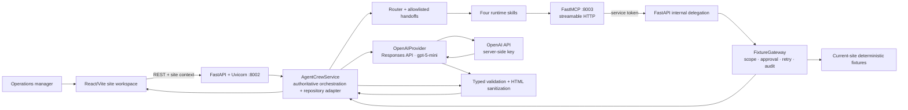
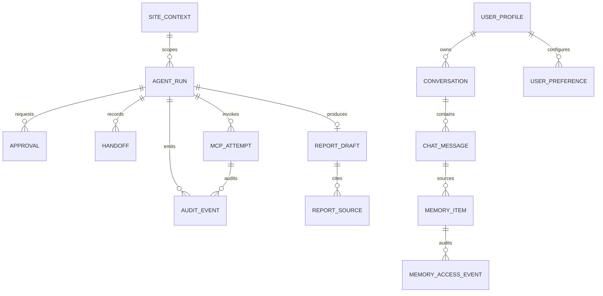

# Current Architecture and Logical DB Schema

**Status:** Current MVP reference  
**Owner:** Software Architect  
**Dependencies:** [Framework and Runtime Decisions](00-framework-decisions.md), [System Architecture](02-system-architecture.md), [Agent Memory and User Preferences Design](15-agent-memory-and-user-preferences-design.md), `services/ems-api/src/agentcrew/app.py`, `service.py`, and `mcp_server.py`  
**Decision source:** [AgentCrew grill session](../../agentcrew-grill-session.html)

The EMS database and MCP target design is defined in [16-ems-database-and-mcp-design.md](16-ems-database-and-mcp-design.md). This document describes the existing AgentCrew persistence baseline; the EMS telemetry schema is a separate bounded context and must not be folded into `DurableRepository`.

## Architecture



The frontend calls only FastAPI. FastMCP is a separate, stateless delegate; FastAPI owns runs, approvals, reports, audits, idempotency, and tool policy.

The designed memory extension adds a FastAPI-owned Memory Manager. It retrieves bounded, authorized chat history and active preferences for a run, while candidate memories remain inactive until user confirmation. The current runtime does not yet persist this design.

## Logical database schema

The local fixture profile uses process-local dictionaries and lists when no `DATABASE_URL` is supplied. When PostgreSQL is configured, the FastAPI-owned repository adapter persists the same site-scoped boundary described below; the migration is checked in under `services/ems-api/migrations/`:



Logical entities are `SITE_CONTEXT`, `AGENT_RUN`, `APPROVAL`, `HANDOFF`, `MCP_ATTEMPT`, `AUDIT_EVENT`, `REPORT_DRAFT`, `REPORT_SOURCE`, `USER_PROFILE`, `CONVERSATION`, `CHAT_MESSAGE`, `MEMORY_ITEM`, `USER_PREFERENCE`, and `MEMORY_ACCESS_EVENT`. All records carry site identity where data isolation matters; audit payloads are redacted and report HTML is sanitized before persistence.

The full standalone artifact is [current-architecture-and-db-schema.html](../current-architecture-and-db-schema.html).

## EMS telemetry persistence target

The current migration contains AgentCrew operational tables only. The planned EMS context adds Bronze/Silver/Gold layers:

```text
Bronze: source_files → ingestion_runs → raw_file_rows / rejected_rows
Silver: sites → assets → asset_channels → canonical_observations
        column_dictionary + metric_dictionary + quality_events
Gold:   derived_metric_values + materialized serving views
```

`derived_metric_values` stores expensive, frequently requested, report-critical, or reproducibility-sensitive calculations. Materialized views serve common site, device, weather, energy, and generation summaries quickly. Each value carries quality, freshness, formula version, dependencies, calculation time, and source-window lineage.

AgentCrew continues to use its existing string `site_id` contract. EMS may use an internal numeric site key, but external API/MCP contracts expose the stable site code. A future key migration requires a separate expand-and-contract decision.

The authoritative retrieval path is `PostgreSQL → async EMS repository → FastAPI → FastMCP typed read tool → AgentCrew`. Fixture mode is explicitly selected for deterministic demos and cannot silently replace production database reads.
