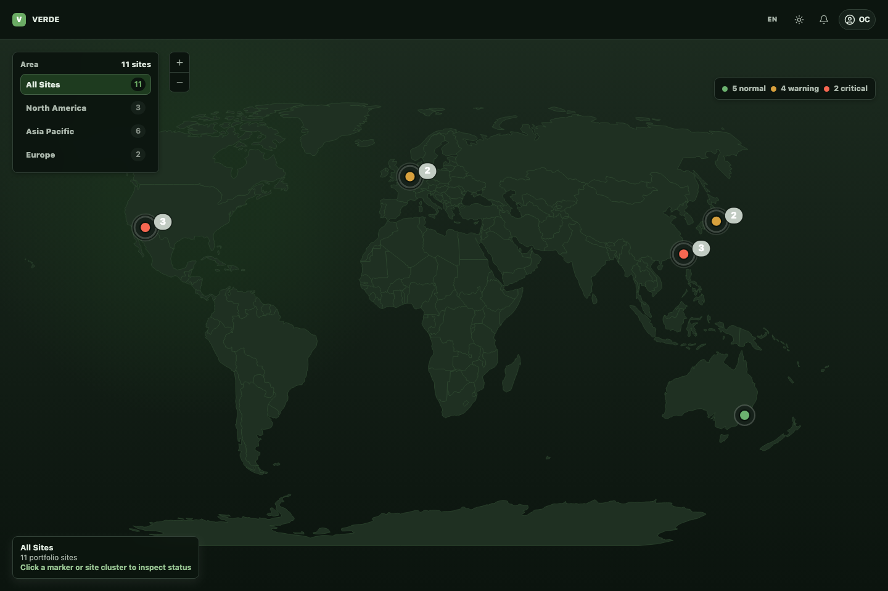
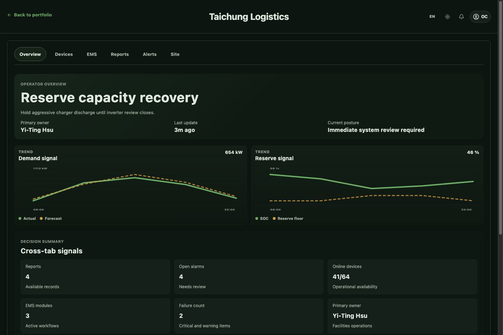
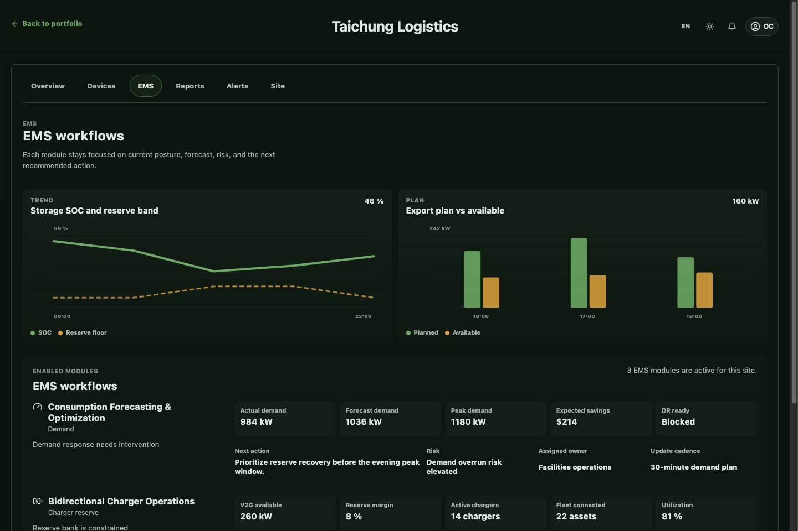
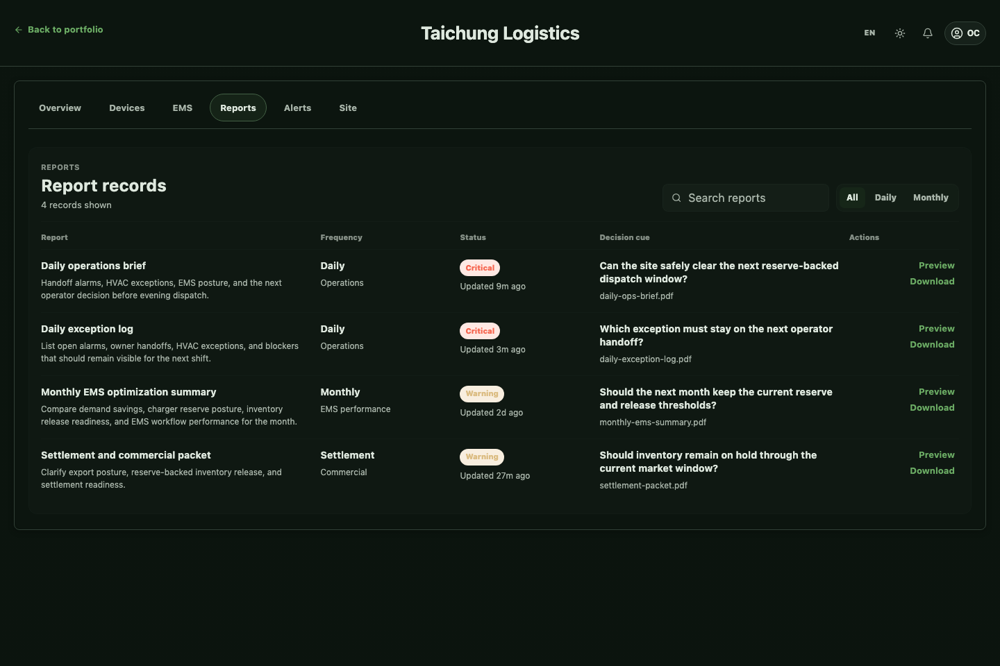
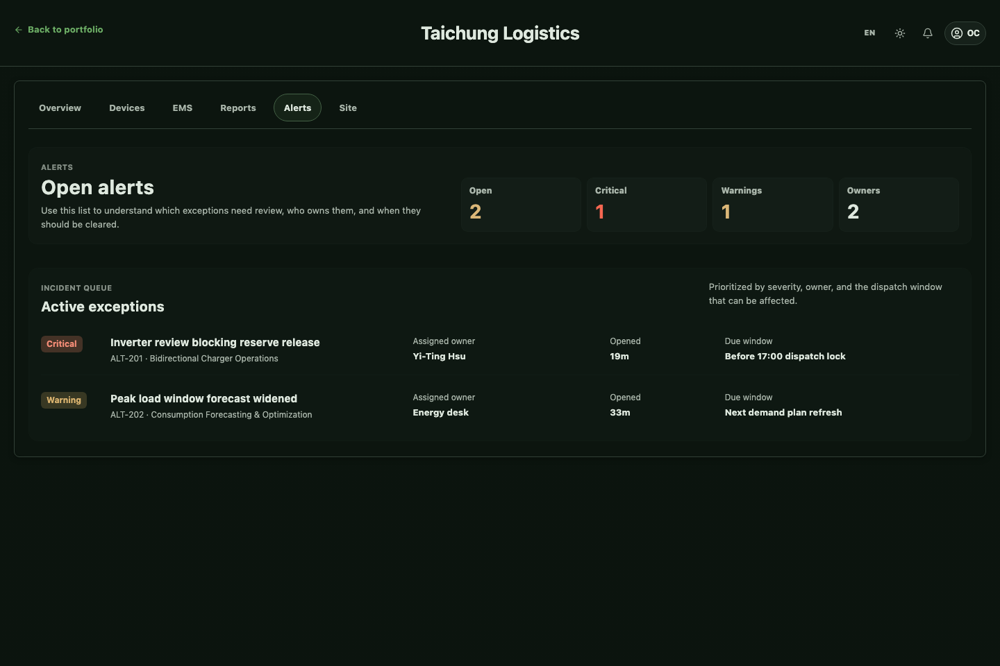

# EMS-Demo

EMS-Demo is a multi-app product workspace for an operational energy platform.

The repository includes a PostgreSQL-backed EMS API contract and a React site
workspace that can run with deterministic demo values. Sample CSV inventories
and raw source datasets are intentionally local-only and are never required for
the application runtime.

The repository is organized around three coordinated apps:

1. `site-integration-app`
2. `internal-operations-app`
3. `energy-operations-app`

Together, they cover site monitoring, internal operations, and EMS decision support.

## Repository Structure

```text
.
├── AGENTS.md
├── README.md
├── docs/
│   └── context/
│       ├── platform/
│       │   ├── PRODUCT.md
│       │   ├── DESIGN.md
│       │   └── REQUEST.md
│       └── apps/
│           ├── site-integration-app/
│           ├── internal-operations-app/
│           └── energy-operations-app/
└── apps/
    ├── site-integration-app/
    ├── internal-operations-app/
    └── energy-operations-app/
```

## Platform Overview

The platform is intended to support:

- Map-first site monitoring for operations managers
- HVAC and site-readiness visibility without SCADA-style overload
- EMS workflows such as generation forecasting, consumption forecasting, sell-power management, bidirectional charging, and energy-resource inventory management
- Internal operations workflows such as work management, ERP-facing data preparation, and report or document generation

## Planned Apps

### 1. Site Integration App

Path: `apps/site-integration-app`

Purpose:
- Provide the map-first operational entry into the platform
- Let users move from portfolio context to site-specific status and action
- Surface HVAC readiness, EMS posture, and site reports in a calm SaaS interface

Current implementation:
- Vite + React app scaffold is in place
- Interactive world map and country drill-in views are implemented
- Site workspace is implemented with `Overview`, `Devices`, `EMS`, `Reports`, `Alerts`, and `Site` sections
- i18n and light/dark theme support are implemented

Screenshots:

| Portfolio map | Site overview |
|---|---|
|  |  |

| EMS workflows | Report records | Open alerts |
|---|---|---|
|  |  |  |

Planned next work:
- Deeper site detail refinement and UX hardening
- Stronger report detail and document workflows
- Better production chunking and code-splitting around map assets
- Additional screens and connected data behaviors beyond demo mode

### 2. Internal Operations App

Path: `apps/internal-operations-app`

Purpose:
- Support internal work management and task coordination
- Handle ERP-adjacent data preparation and exchange
- Support report, form, and document generation

Current implementation:
- Product scope is defined in `docs/context/apps/internal-operations-app/PRODUCT.md`
- Vite + React application shell is in place with route-based navigation
- Overview, new-document, generator, document-library, run-history, and context-management pages are implemented
- Tender, financial report, PPTX, and operations memo generators provide structured inputs, mock async generation states, draft previews, and local draft persistence
- English and Traditional Chinese localization plus light and dark themes are implemented
- The current frontend is a browser-only prototype backed by mock data; no production API or LLM service is connected yet

Planned next work:
- Add richer document templates and field schemas per generator
- Connect generation actions to real backend or LLM services
- Expand export, review, collaboration, and version-comparison flows
- Add production persistence, authentication, permissions, and ERP-facing integrations

### 3. Energy Operations App

Path: `apps/energy-operations-app`

Purpose:
- Support EMS forecasting and operational decision workflows
- Help users manage generation, consumption, sell-power, and bidirectional charging logic
- Track energy-resource commercialization and inventory

Current implementation:
- Product scope is defined in `docs/context/apps/energy-operations-app/PRODUCT.md`
- No frontend application scaffold has been created yet

Planned next work:
- Define screen architecture
- Create the frontend app scaffold
- Build EMS-specific forecasting, dispatch, and inventory workflows

## Status

| App | Purpose | Current Status | Notes |
|---|---|---|---|
| `site-integration-app` | Site monitoring and site entry | In progress / demo implemented | Working frontend with map and site workspace |
| `internal-operations-app` | Internal ops and ERP-adjacent workflows | In progress / prototype implemented | Routed document-generation workspace with library, runs, context, localization, and themes |
| `energy-operations-app` | EMS forecasting and energy operations | Planned | Scope documented, app not built yet |

## Done vs Not Done

### Done

- Repo-level product and design direction are documented
- `site-integration-app` has a working Vite React implementation
- `internal-operations-app` has a working Vite React implementation
- Site map interaction, country drill-down, site workspace, i18n, and theming are present
- Internal operations document-generation workspace, library, run history, and context-management surfaces are present
- Product definition docs exist for the internal operations and energy operations apps

### Not Done Yet

- `energy-operations-app` frontend implementation
- Shared cross-app design system extraction
- Production backend/data connections
- Final documentation for setup, scripts, and local development workflow across all apps

## Source of Scope

Primary planning inputs live in:

- `docs/context/README.md`
- `docs/context/platform/PRODUCT.md`
- `docs/context/platform/DESIGN.md`
- `docs/context/platform/REQUEST.md`
- `docs/context/apps/site-integration-app/README.md`
- `docs/context/apps/internal-operations-app/PRODUCT.md`
- `docs/context/apps/energy-operations-app/PRODUCT.md`

Root-level `PRODUCT.md`, `DESIGN.md`, and `REQUEST.md` are compatibility pointers to the canonical files under `docs/context/`.

## Local Development

The quickest path is Docker Compose. It starts PostgreSQL, applies the real EMS
schema migrations, loads deterministic synthetic values, starts the API, and
serves the site workspace.

### One-command local setup

Requirements: Docker Desktop with Compose v2.

```bash
git clone <repository-url>
cd EMS-Demo
docker compose up --build
```

The Compose file includes safe deterministic defaults. Review `.env.example`
when changing the local provider or database settings; do not commit secrets.

Open [http://localhost:5180](http://localhost:5180) for the site workspace or
[http://localhost:8004/docs](http://localhost:8004/docs) for the API contract.

The first startup creates the `ems` PostgreSQL schema through Alembic and runs
the idempotent `seed-ems` command. The seed is synthetic, covers one year of
site observations and calculated metrics, and is safe to rerun. Stop the stack
with `Ctrl+C`, or run `docker compose down`. Keep the named volume when you
want to preserve the local database; add `-v` only when you intentionally want
to reset it.

### Manual frontend development

Use this mode when iterating on React files while keeping PostgreSQL and the API
in Docker:

```bash
docker compose up -d postgres api
cd apps/site-integration-app
npm install
VITE_AGENTCREW_API_URL=http://127.0.0.1:8004/api/v1 npm run dev -- --host 0.0.0.0 --port 5180
```

Run the site integration app:

```bash
cd apps/site-integration-app
npm install
npm run dev
```

Run the internal operations app:

```bash
cd apps/internal-operations-app
npm install
npm run dev
```

To create a production build of either app, run `npm run build` from that app's directory.

### EMS API and database

The EMS backend lives in `services/ems-api` and exposes the unified site,
observation, derived-metric, report, and MCP retrieval contracts described in
`docs/context/` and `AppDeploy/agent-team/docs/`. PostgreSQL is the persistence
boundary for site metadata, time-series observations, calculated metrics, and
source lineage; the frontend should not calculate long-range metrics on every
screen render.

The Compose services are:

| Service | Responsibility | Host address |
|---|---|---|
| `postgres` | PostgreSQL persistence for EMS and AgentCrew tables | `localhost:5432` |
| `api` | FastAPI site reads, calculated metrics, reports, and MCP contracts | `localhost:8004` |
| `site-integration` | Production build of the React site | `localhost:5180` |

Typical local services without Docker:

```bash
# Start PostgreSQL and the API, including migrations and synthetic seed data
docker compose up -d postgres api

# Start the API
cd services/ems-api
PYTHONPATH=src .venv/bin/python -m uvicorn agentcrew.app:app --host 0.0.0.0 --port 8004

# Start the site workspace in another shell
cd apps/site-integration-app
VITE_AGENTCREW_API_URL=http://127.0.0.1:8004/api/v1 npm run dev -- --host 0.0.0.0 --port 5180
```

To seed a manually started API database after migrations:

```bash
cd services/ems-api
PYTHONPATH=src .venv/bin/python -m agentcrew seed-ems --seed-version 3
```

The frontend reads site snapshots, observations, reports, and metric catalogs
from the API. Long-range calculations are persisted in
`ems.derived_metric_values`; the dashboard does not recompute a year's worth of
data in the browser.

The API uses deterministic fixture values for the demo, but the schema and
retrieval paths are designed to match the production PostgreSQL contract.

## Dataset and secret policy

Do not commit or push raw datasets, customer exports, credentials, database
dumps, or generated report files. In particular, `docs/EMS-sampledata/` is
local-only and is ignored by Git. Keep fixtures small, synthetic, and schema-
focused; use README files or schemas to describe data shapes instead of
including source rows.

Before publishing a branch, review the exact staged file list:

```bash
git diff --cached --name-only
git diff --cached --name-only | rg -i '(\.csv$|\.parquet$|\.sqlite$|\.db$|\.dump$|\.sql$|sampledata|datasets?|mock-data)'
```

The second command should return no files for a documentation-only or UI
branch.
